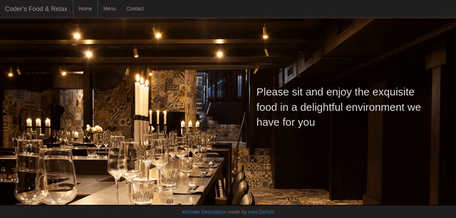
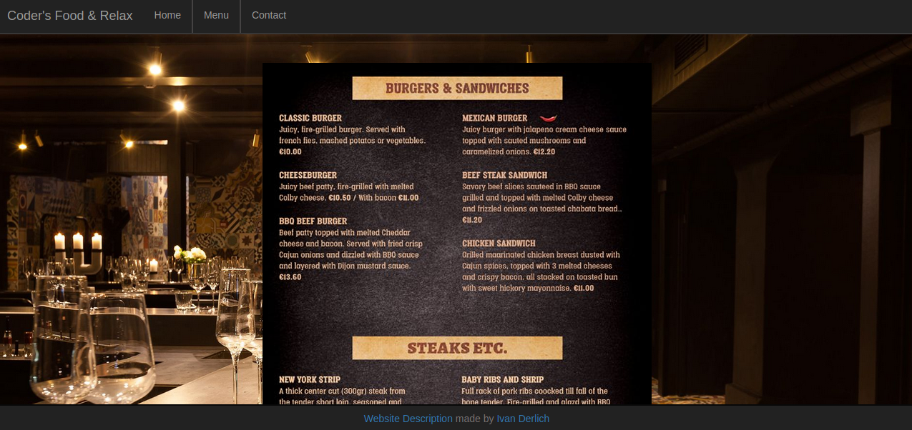
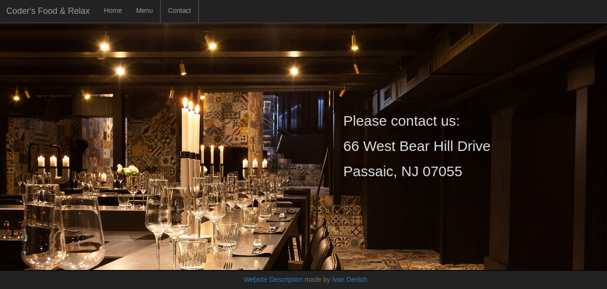

# Restaurant Landing Website

A restaurant landing website using Webpack and NPM.

## Demo

## Video

[Here](https://www.youtube.com/watch?v=Fy6IHJ96z7k).

## Live Version

[Github Pages](https://ivanderlich.github.io/restaurant-homepage).

## Installation

Download the source code from GitHub:

    git clone https://github.com/IvanDerlich/restaurant-homepage.git  

Move to the directory of the downloaded folder:

    cd restaurant-homepage

Install the project's dependencies:

    npm install

Build the project:

    npm run build

If the previous command doesn't open the index.html file in your default browser, then open it manually. It's located in the 'dist' folder.

## Guides

[Microverse](https://microverse.pathwright.com/library/fast-track-curriculum/69047/path/step/59622983/).

[Odin Project](https://www.theodinproject.com/courses/javascript/lessons/restaurant-page).

## Technologies used

- Node Package Manager.
- Webpack.

## Author of this project

[Ivan Derlich](https://github.com/IvanDerlich/).
